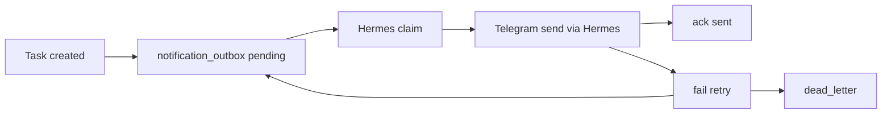

# Event Genix Hermes notification_outbox Runbook

This runbook documents the CRM-side outbox used for Hermes task direct-message
delivery. It is for developers and operators working on Event Genix CRM and
Hermes delivery workers.

## 1. Purpose

`notification_outbox` is the durable CRM-side source of truth for task
notification events that Hermes should deliver as Telegram direct messages.

The intended flow is:

```text
CRM Task Service
  -> CRM notification_outbox
  -> Hermes Delivery Worker
  -> Telegram DM through Hermes/main-agent
```

The outbox exists so CRM task creation does not depend on immediate Telegram
delivery. CRM records the event first, Hermes claims and delivers it, then
Hermes acknowledges or fails the event through the CRM API.

## 2. Architecture



Rules:

- `notification_outbox` is the source of truth.
- Webhooks, if added later, are accelerators only.
- CRM legacy Telegram bot delivery is not the Hermes-native task DM channel.
- Hermes delivery must not be implemented by calling `services/telegram.js`
  from the CRM outbox path.

## 3. Current V0.6 Fallback

The temporary V0.6 fallback is a Hermes-side polling worker:

- Job id: `74d7a31ef2ab`
- Name: `Event Genix Hermes Task DM - all approved owners`
- Script: `event_genix_hermes_task_dm_all_owners_cron.py`
- Schedule: every 5 minutes

It reads CRM read-only endpoints:

- `GET /api/hermes/tasks?ownerUserId=<id>&limit=50`
- `GET /api/hermes/my-cabinet?ownerUserId=<id>`

Approved owners in the fallback:

- Sergiy: `ownerUserId=4`
- Nataliia: `ownerUserId=3`

Do not change Hermes cron jobs from the CRM repo without explicit owner
approval. Keep V0.6 polling available as the incident fallback until the
Hermes delivery worker has been approved and proven in production.

## 4. notification_outbox Table Fields

Migration: `db/migrations/273_notification_outbox.sql`

Important fields:

| Field | Purpose |
| --- | --- |
| `id` | Internal primary key and cursor source. |
| `event_id` | Unique deterministic event identity. |
| `task_id` | CRM task reference. |
| `owner_user_id` | CRM responsible user id. |
| `event_type` | Event type such as `task_created`. |
| `payload_json` | Sanitized delivery payload for Hermes. |
| `payload_hash` | Stable hash for idempotency and duplicate protection. |
| `status` | Lifecycle status. |
| `attempts` | Delivery failure attempt count. |
| `available_at` | Earliest time the event may be listed/claimed. |
| `created_at` | Row creation time. |
| `claimed_at` | Last claim time. |
| `sent_at` | Delivery acknowledgment time. |
| `last_error` | Sanitized last failure message. |
| `last_error_code` | Machine-readable last failure code. |
| `last_delivery_channel` | Last delivery channel, for example `telegram`. |
| `last_delivery_target` | Last delivery target id. |
| `claimed_by` | Worker id that claimed the event. |
| `locked_until` | Claim lock expiry. |
| `updated_at` | Last row update time. |

Allowed statuses:

- `pending`
- `claimed`
- `sent`
- `failed`
- `dead_letter`
- `skipped`

Initial active event types:

- `task_created`
- `task_assigned`

Reserved future event types:

- `task_reminder_due`
- `task_overdue`
- `task_updated`

## 5. Event Lifecycle

1. `createTask()` creates the CRM task.
2. If the task has an owner and is active, CRM inserts one `pending` outbox
   event.
3. Hermes reads available events from `/api/hermes/notification-outbox`.
4. Hermes claims one event with `/claim`, setting `status=claimed`,
   `claimed_by`, `claimed_at`, and `locked_until`.
5. Hermes sends the Telegram DM through Hermes/main-agent.
6. Hermes calls `/ack` after delivery, setting `status=sent`.
7. If delivery fails, Hermes calls `/fail`.
8. Retryable failures move the event to `failed` with a future
   `available_at`.
9. Exhausted or non-retryable failures move to `dead_letter`.

Task creation does not send Telegram directly through the outbox path.

## 6. Hermes API Endpoints

All endpoints are under `/api/hermes` and use the existing Hermes auth.

| Method | Path | Purpose |
| --- | --- | --- |
| `GET` | `/notification-outbox?status=pending&limit=50` | List available events. |
| `GET` | `/notification-outbox/:eventId` | Read one sanitized event. |
| `POST` | `/notification-outbox/:eventId/claim` | Claim an event for a worker. |
| `POST` | `/notification-outbox/:eventId/ack` | Mark delivery as sent. |
| `POST` | `/notification-outbox/:eventId/fail` | Record delivery failure. |
| `GET` | `/notification-outbox/stats` | Read safe aggregate queue diagnostics. |
| `GET` | `/notification-outbox/debug?limit=20` | Read safe diagnostic event rows. |

List query parameters:

- `status`: one of the allowed statuses, default `pending`
- `limit`: default `20`, max `50`
- `cursor`: numeric cursor
- `ownerUserId`: optional owner filter
- `eventType`: optional event type filter

Claim body:

```json
{
  "workerId": "hermes-worker-1",
  "lockSeconds": 120
}
```

Ack body:

```json
{
  "workerId": "hermes-worker-1",
  "channel": "telegram",
  "target": "674972415",
  "deliveryId": "optional-provider-id",
  "messageHash": "optional-message-hash",
  "sentAt": "2026-06-29T12:03:00.000Z"
}
```

Fail body:

```json
{
  "workerId": "hermes-worker-1",
  "errorCode": "TELEGRAM_RATE_LIMIT",
  "errorMessage": "rate limited",
  "retryable": true
}
```

## 7. Retry And dead_letter Policy

Retryable `/fail` responses increment `attempts` and move `available_at`
forward:

| Attempt | Delay |
| --- | --- |
| 1 | 1 minute |
| 2 | 5 minutes |
| 3 | 30 minutes |
| 4 | 2 hours |
| 5 | `dead_letter` |

Non-retryable failures move directly to `dead_letter`.

`/ack` is idempotent for already sent events. A second ack returns success and
does not corrupt the sent status.

## 8. Security And Auth

Preferred auth header:

```http
x-api-key: <Hermes CRM API key>
```

Allowed fallback:

```http
Authorization: Bearer <Hermes CRM API key>
```

Do not document, print, commit, or paste real API keys, bot tokens, cookies,
raw headers, or production payload dumps.

Outbox payloads and debug responses must stay sanitized. By default,
diagnostic endpoints do not return full `payload_json`, raw private client
details, stack traces, secrets, or raw provider responses.

## 9. Feature Flags

Current CRM code supports outbox event creation flags:

- `HERMES_TASK_OUTBOX_ENABLED=true|false`
- `HERMES_NOTIFICATION_OUTBOX_ENABLED=true|false`
- `NOTIFICATION_OUTBOX_ENABLED=true|false`

If neither flag is set, outbox creation defaults on only in local/test-like
runtime modes and remains conservative elsewhere.

Preferred operational flag:

- `HERMES_NOTIFICATION_OUTBOX_ENABLED=true|false`

Compatibility flags remain supported for existing environments. Explicit flag
values override default runtime behavior.

## 10. How To Test Locally

Use the repository Node baseline:

```powershell
npm run check:runtime
```

If the local shell is not Node 22/npm 10, use:

```powershell
npx -y -p node@22 -p npm@10 -c "npm run check:runtime"
```

Focused outbox tests:

```powershell
npx -y -p node@22 -p npm@10 -c "node --test tests/notification-outbox.test.js tests/kleshnya-notification-outbox.test.js tests/hermes-notification-outbox.test.js tests/notification-outbox-lifecycle.test.js"
```

Full unit baseline:

```powershell
npx -y -p node@22 -p npm@10 -c "npm run test:unit"
```

Static checks:

```powershell
npx -y -p node@22 -p npm@10 -c "npm run check:syntax"
npx -y -p node@22 -p npm@10 -c "npm run check:api-surface"
npx -y -p node@22 -p npm@10 -c "npm run check:migrations"
```

Do not run live Telegram sends as a local test.

## 11. How To Inspect Stuck Events

Preferred safe API:

```http
GET /api/hermes/notification-outbox/stats
GET /api/hermes/notification-outbox/debug?limit=20
```

Use stats to check queue depth:

- `pending`: waiting to be claimed
- `claimed`: currently locked by a worker
- `failed`: retryable failures waiting for `available_at`
- `dead_letter`: exhausted or non-retryable failures
- `skipped`: intentionally skipped events
- `sent_24h`: recent successful deliveries

Use debug to inspect safe row metadata:

- `event_id`
- `task_id`
- `owner_user_id`
- `event_type`
- `status`
- `attempts`
- `created_at`
- `available_at`
- `last_error_code`

If direct DB inspection is approved for a non-production environment, use
bounded, sanitized reads only. Example:

```sql
SELECT event_id, task_id, owner_user_id, event_type, status, attempts,
       created_at, available_at, locked_until, claimed_by, last_error_code
FROM notification_outbox
ORDER BY created_at DESC
LIMIT 50;
```

Do not select `payload_json` by default during incident triage.

## 12. Rollback Plan

If CRM outbox feature causes issues:

- Disable event creation with feature flag/config.
- Keep table for diagnostics.
- Keep V0.6 Hermes polling cron as fallback.
- Do not drop `notification_outbox` table during incident.
- Do not change Hermes cron without explicit owner approval.

Operational rollback sequence:

1. Set `HERMES_NOTIFICATION_OUTBOX_ENABLED=false`,
   `HERMES_TASK_OUTBOX_ENABLED=false`, or `NOTIFICATION_OUTBOX_ENABLED=false`
   in the affected CRM environment.
2. Restart only after normal environment-change approval.
3. Confirm `/api/hermes/notification-outbox/stats` still works for diagnostics.
4. Leave existing outbox rows intact for post-incident analysis.
5. Continue using the V0.6 Hermes polling cron until the owner approves a new
   delivery-worker activation plan.

Schema rollback is not the incident path. Dropping the table removes evidence
and may break diagnostics.

## 13. E2E Smoke Approval Gate

Any end-to-end smoke that can send a real Telegram DM, mutate production data,
change Railway, activate a webhook, or change Hermes cron jobs requires explicit
owner approval before execution.

Approval-gated smoke checklist:

1. Confirm target environment and CRM base URL.
2. Confirm Hermes API credentials are configured without printing them.
3. Confirm approved test owner/user and Telegram target.
4. Create or select a non-client test task.
5. Confirm one `pending` outbox row appears.
6. Run Hermes claim/send/ack path.
7. Confirm status moves to `sent`.
8. Confirm no legacy CRM/Park bot path was used for Hermes-native delivery.
9. Record sanitized results only.

Do not execute this checklist against production or live Telegram without
explicit approval.
