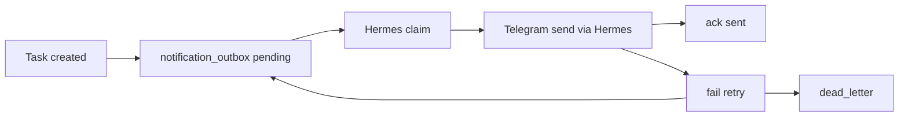

# Event Genix Hermes notification_outbox Runbook

This runbook documents the CRM-side outbox used for Hermes task direct-message
delivery. It is for developers and operators working on Event Genix CRM and
Hermes delivery workers.

## 1. Purpose

`notification_outbox` is the durable CRM-side source of truth for task
notification events that Hermes should deliver as Telegram direct messages.

The intended flow is:

```text
CRM Task Service
  -> CRM notification_outbox
  -> Hermes Delivery Worker
  -> Telegram DM through Hermes/main-agent
```

The outbox exists so CRM task creation does not depend on immediate Telegram
delivery. CRM records the event first, Hermes claims and delivers it, then
Hermes acknowledges, fails, or skips the event through the CRM API.

## 2. Architecture



Rules:

- `notification_outbox` is the source of truth.
- Hermes, the Telegram gateway, and webhooks are delivery layers or
  accelerators. They are not the CRM source of truth.
- CRM legacy Telegram bot delivery is not the Hermes-native task DM channel.
- Hermes delivery must not be implemented by calling `services/telegram.js`
  from the CRM outbox path.

## 3. Current Delivery Boundary

This repository documents CRM behavior only. It must not be used to recreate,
disable, or edit Hermes jobs, gateway processes, Telegram routes, Railway
settings, or production environment variables.

Historical notes may mention older V0.6 polling jobs or fallback scripts. Treat
those as history unless a fresh Hermes-side audit verifies them. Do not present
old job ids or scripts as active instructions from this CRM runbook.

The intended current CRM-side delivery flow is:

```text
CRM createTask()
  -> notification_outbox task event
  -> Hermes worker claims event
  -> Hermes/gateway sends Telegram DM
  -> Hermes ack/fail/skip callback to CRM
```

Owner route policy:

- Normal task/task reminder delivery is owner-facing: route by `owner_user_id` to
  the approved Secretary/Hermes Telegram route.
- Coordinator/group Telegram fallback is forbidden for normal task creation,
  assignment, reminder, and status-change notifications. Coordinator visibility
  is allowed only for explicit escalation/error routes.
- The CRM stores `owner_user_id` and outbox state, not Telegram route truth.
- `ownerUserId=1` is Віталіна in current audit context. Do not silently map
  owner 1 to Сергій.
- If Hermes has no route for an owner, the worker should mark the event
  `skipped` with `last_error_code=MISSING_TELEGRAM_ROUTE`.
- Route configuration changes require separate operational approval outside
  CRM code work.

## 4. notification_outbox Table Fields

Migration: `db/migrations/273_notification_outbox.sql`

Important fields:

| Field | Purpose |
| --- | --- |
| `id` | Internal primary key and cursor source. |
| `event_id` | Unique deterministic event identity. |
| `task_id` | CRM task reference. |
| `owner_user_id` | CRM responsible user id. |
| `event_type` | Event type such as `task_created`. |
| `payload_json` | Sanitized delivery payload for Hermes. |
| `payload_hash` | Stable hash for idempotency and duplicate protection. |
| `status` | Lifecycle status. |
| `attempts` | Delivery failure attempt count. |
| `available_at` | Earliest time the event may be listed/claimed. |
| `created_at` | Row creation time. |
| `claimed_at` | Last claim time. |
| `sent_at` | Delivery acknowledgment time. |
| `last_error` | Sanitized last failure message. |
| `last_error_code` | Machine-readable last failure code. |
| `last_delivery_channel` | Last delivery channel, for example `telegram`. |
| `last_delivery_target` | Last delivery target id. |
| `claimed_by` | Worker id that claimed the event. |
| `locked_until` | Claim lock expiry. |
| `updated_at` | Last row update time. |

Allowed statuses:

- `pending`
- `claimed`
- `sent`
- `failed`
- `dead_letter`
- `skipped`

Initial active event types:

- `task_created`
- `task_assigned`

Reserved future event types:

- `task_reminder_due`
- `task_overdue`
- `task_updated`

## 5. Event Lifecycle

1. `createTask()` creates the CRM task.
2. If the task has an owner and is active, CRM inserts one `pending` outbox
   event.
3. Hermes reads available events from `/api/hermes/notification-outbox`.
4. Hermes claims one event with `/claim`, setting `status=claimed`,
   `claimed_by`, `claimed_at`, and `locked_until`.
5. Hermes sends the Telegram DM through Hermes/main-agent.
6. Hermes calls `/ack` after delivery, setting `status=sent`.
7. If delivery fails, Hermes calls `/fail`.
8. Retryable failures move the event to `failed` with a future
   `available_at`.
9. Exhausted or non-retryable failures move to `dead_letter`.
10. If delivery is permanently unsupported, for example no Telegram route is
    configured for the owner, Hermes calls `/skip` with a sanitized reason.
    Missing-route skips should use `last_error_code=MISSING_TELEGRAM_ROUTE`.

Task creation does not send Telegram directly through the outbox path.
When CRM creates or finds a `notification_outbox` task event, Hermes owns that
task-created delivery and the legacy CRM Telegram assignment notification is not
sent for the same task. If outbox creation is disabled, explicitly skipped, or
fails, the existing legacy notification fallback may still run when
`skipNotifications` is not set.

## 6. Hermes API Endpoints

All endpoints are under `/api/hermes` and use the existing Hermes auth.

Current supported action names include:

- `tasks.read`
- `tasks.detail`
- `tasks.history`
- `tasks.my_cabinet`
- `tasks.create`
- `tasks.complete`
- `tasks.completion_report`
- `tasks.comment`
- `tasks.subtasks.read`
- `tasks.subtask.toggle`
- `tasks.reassign`
- `tasks.reschedule`
- `tasks.status`
- `diagnostics.owner_workload`
- `notification_outbox.read`
- `notification_outbox.detail`
- `notification_outbox.claim`
- `notification_outbox.ack`
- `notification_outbox.fail`
- `notification_outbox.skip`
- `notification_outbox.stats`
- `notification_outbox.debug`

Task endpoints currently relevant to Hermes:

| Method | Path | Purpose |
| --- | --- | --- |
| `GET` | `/tasks` | List visible tasks. |
| `GET` | `/tasks/:id` | Read sanitized task detail. |
| `GET` | `/tasks/:id/history` | Read sanitized task history. |
| `GET` | `/my-cabinet` | Read owner cabinet projection. |
| `POST` | `/tasks` | Create a task with mutation guard and idempotency. |
| `POST` | `/tasks/:id/complete` | Complete a task, optionally with `reportId`. |
| `POST` | `/tasks/:id/completion-report` | Create a durable completion report and link `tasks.control_meta.reportId`; does not auto-complete. |
| `POST` | `/tasks/:id/comments` | Write a structured task comment into `task_action_history`; does not mutate task status. |
| `GET` | `/tasks/:id/subtasks` | Read visible task subtasks with safe done/open counts. |
| `PATCH` | `/tasks/:id/subtasks/:subtaskId` | Toggle `is_done` for an existing subtask with mutation guard and idempotency. |
| `POST` | `/tasks/:id/reassign` | Reassign a visible task. |
| `POST` | `/tasks/:id/reschedule` | Reschedule a visible task. |
| `POST` | `/tasks/:id/status` | Move a task between `todo` and `in_progress`. |

Hermes completion report body:

```json
{
  "reportText": "Completed task details",
  "type": "expense",
  "amount": 0,
  "category": "Задача",
  "businessContext": "event_genix"
}
```

Completion report rules:

- Requires Hermes auth, mutation confirmation, idempotency key, and writable
  single-business scope.
- Uses the same CRM `reports` table semantics as the web task completion report
  flow.
- Links the durable report with `tasks.control_meta.reportId`.
- Returns `reportId`, a sanitized task summary, and meta fields
  `durableReport=reports` and `linkField=tasks.control_meta.reportId`.
- Does not return raw report text, `raw_data`, secrets, or private payloads.
- Does not auto-complete the task. Hermes must call
  `POST /api/hermes/tasks/:id/complete` with `reportId` when the task should be
  completed.

Hermes task comment body:

```json
{
  "text": "Comment text",
  "source": "telegram_tasker",
  "businessContext": "event_genix"
}
```

Task comment rules:

- Requires Hermes auth, mutation confirmation, idempotency key, and writable
  single-business scope.
- Enforces the same visible mutable task policy as other Hermes task writes.
- Rejects unsupported fields and empty `text`.
- Sanitizes control characters and bounds stored comment text length.
- Uses `task_action_history` with `action_type=task_commented`; no
  `task_comments` table or schema migration is required.
- Returns stable `commentId`/`logId` and sanitized meta only.
- Does not return raw comment text, private payloads, or secrets in the create
  response.

Hermes subtask toggle body:

```json
{
  "is_done": true
}
```

Subtask rules:

- `GET /tasks/:id/subtasks` requires Hermes auth and readable single-business
  scope.
- `PATCH /tasks/:id/subtasks/:subtaskId` requires Hermes auth, mutation
  confirmation, idempotency key, writable single-business scope, and visible
  mutable task access.
- PATCH accepts only `is_done` or `isDone`. It does not create, reorder, rename,
  or delete subtasks.
- Toggle updates `task_subtasks.is_done`, sets `completed_at` when done, clears
  it when reopened, and touches the parent task `updated_at/version`.
- Responses return sanitized subtask fields and parent done/open counts only.
- Parent task completion remains blocked while any subtask is still open.

| Method | Path | Purpose |
| --- | --- | --- |
| `GET` | `/notification-outbox?status=pending&limit=50` | List available events. |
| `GET` | `/notification-outbox/:eventId` | Read one sanitized event. |
| `POST` | `/notification-outbox/:eventId/claim` | Claim an event for a worker. |
| `POST` | `/notification-outbox/:eventId/ack` | Mark delivery as sent. |
| `POST` | `/notification-outbox/:eventId/fail` | Record delivery failure. |
| `POST` | `/notification-outbox/:eventId/skip` | Mark permanent non-delivery without dead-lettering. |
| `GET` | `/notification-outbox/stats` | Read safe aggregate queue diagnostics. |
| `GET` | `/notification-outbox/debug?limit=20` | Read safe diagnostic event rows. |

Owner diagnostics endpoints:

| Method | Path | Purpose |
| --- | --- | --- |
| `GET` | `/diagnostics/owner-workload` | Read aggregate owner active/urgent load and outbox route-risk counts. |

Owner workload diagnostics rules:

- Requires Hermes auth and readable business scope.
- It is read-only and must not reassign owners, call Telegram, update route config,
  or mutate task/outbox rows.
- Counts active tasks, urgent active tasks, pending outbox events, skipped outbox
  events, and missing-route skipped events grouped by `ownerUserId`.
- Outbox counts are scoped through joined CRM tasks, because
  `notification_outbox` is not route-config truth and must not bypass task
  business scope.
- `deliveryRouteStatus` is `unknown` when CRM has no reliable local route
  source. Do not infer Telegram route availability from owner names or old
  incident notes.
- `meta.routeTruthSource` is `not_configured_in_crm`.
- The response must stay aggregate-only: no task titles, descriptions, client
  details, phones, `payload_json`, tokens, cookies, raw headers, or secrets.

List query parameters:

- `status`: one of the allowed statuses, default `pending`
- `limit`: default `20`, max `50`
- `cursor`: numeric cursor
- `ownerUserId`: optional owner filter
- `eventType`: optional event type filter

Claim body:

```json
{
  "workerId": "hermes-worker-1",
  "lockSeconds": 120
}
```

Ack body:

```json
{
  "workerId": "hermes-worker-1",
  "channel": "telegram",
  "target": "674972415",
  "deliveryId": "optional-provider-id",
  "messageHash": "optional-message-hash",
  "sentAt": "2026-06-29T12:03:00.000Z"
}
```

Fail body:

```json
{
  "workerId": "hermes-worker-1",
  "errorCode": "TELEGRAM_RATE_LIMIT",
  "errorMessage": "rate limited",
  "retryable": true
}
```

Skip body:

```json
{
  "workerId": "hermes-worker-1",
  "reasonCode": "MISSING_TELEGRAM_ROUTE",
  "reasonMessage": "No Telegram route configured for ownerUserId=1"
}
```

## 7. Retry And dead_letter Policy

Retryable `/fail` responses increment `attempts` and move `available_at`
forward:

| Attempt | Delay |
| --- | --- |
| 1 | 1 minute |
| 2 | 5 minutes |
| 3 | 30 minutes |
| 4 | 2 hours |
| 5 | `dead_letter` |

Non-retryable failures move directly to `dead_letter`.

`/ack` is idempotent for already sent events. A second ack returns success and
does not corrupt the sent status.

`/skip` is idempotent for already skipped events. It accepts `pending`,
`failed`, and same-worker `claimed` events, and rejects `sent` or `dead_letter`
events. Skipped events are not claimable as deliverable pending events.

## 8. Security And Auth

Preferred auth header:

```http
x-api-key: <Hermes CRM API key>
```

Allowed fallback:

```http
Authorization: Bearer <Hermes CRM API key>
```

Do not document, print, commit, or paste real API keys, bot tokens, cookies,
raw headers, or production payload dumps.

Outbox payloads and debug responses must stay sanitized. By default,
diagnostic endpoints do not return full `payload_json`, raw private client
details, stack traces, secrets, or raw provider responses.

## 9. Feature Flags

Current CRM code supports outbox event creation flags:

- `HERMES_TASK_OUTBOX_ENABLED=true|false`
- `HERMES_NOTIFICATION_OUTBOX_ENABLED=true|false`
- `NOTIFICATION_OUTBOX_ENABLED=true|false`

If neither flag is set, outbox creation defaults on only in local/test-like
runtime modes and remains conservative elsewhere.

Preferred operational flag:

- `HERMES_TASK_OUTBOX_ENABLED=true|false`

Compatibility flags remain supported for existing environments. Explicit flag
values override default runtime behavior.

`GET /api/hermes/capabilities` exposes the effective boolean as
`features.taskOutboxEmitEnabled`. The response must not include raw environment
variable values or secrets.

Production-like environments should set an explicit value. Do not infer
production enablement from local/test defaults.

## 10. How To Test Locally

Use the repository Node baseline:

```powershell
npm run check:runtime
```

If the local shell is not Node 22/npm 10, use:

```powershell
npx -y -p node@22 -p npm@10 -c "npm run check:runtime"
```

Focused outbox tests:

```powershell
npx -y -p node@22 -p npm@10 -c "node --test tests/notification-outbox.test.js tests/notification-outbox-lifecycle.test.js tests/hermes-notification-outbox.test.js tests/kleshnya-notification-outbox.test.js"
```

Focused Hermes route tests:

```powershell
npx -y -p node@22 -p npm@10 -c "node --test tests/hermes-routes.test.js"
```

Full unit baseline:

```powershell
npx -y -p node@22 -p npm@10 -c "npm run test:unit"
```

Static checks:

```powershell
npx -y -p node@22 -p npm@10 -c "npm run check:syntax"
npx -y -p node@22 -p npm@10 -c "npm run check:api-surface"
npx -y -p node@22 -p npm@10 -c "npm run check:migrations"
```

Do not run live Telegram sends as a local test.

## 11. How To Inspect Stuck Events

Preferred safe API:

```http
GET /api/hermes/notification-outbox/stats
GET /api/hermes/notification-outbox/debug?limit=20
```

Use stats to check queue depth:

- `pending`: waiting to be claimed
- `claimed`: currently locked by a worker
- `failed`: retryable failures waiting for `available_at`
- `dead_letter`: exhausted or non-retryable failures
- `skipped`: intentionally skipped events
- `blocked_missing_route`: skipped events with `MISSING_TELEGRAM_ROUTE`
- `sent_24h`: recent successful deliveries

Use debug to inspect safe row metadata:

- `event_id`
- `task_id`
- `owner_user_id`
- `event_type`
- `status`
- `attempts`
- `created_at`
- `available_at`
- `last_error_code`
- `last_error`

If direct DB inspection is approved for a non-production environment, use
bounded, sanitized reads only. Example:

```sql
SELECT event_id, task_id, owner_user_id, event_type, status, attempts,
       created_at, available_at, locked_until, claimed_by, last_error_code
FROM notification_outbox
ORDER BY created_at DESC
LIMIT 50;
```

Do not select `payload_json` by default during incident triage.

## 12. Rollback Plan

If CRM outbox feature causes issues:

- Disable event creation with feature flag/config.
- Keep table for diagnostics.
- Use only a currently verified Hermes fallback plan. Historical V0.6 polling
  notes are not active instructions by themselves.
- Do not drop `notification_outbox` table during incident.
- Do not change Hermes cron, gateway, route config, or Railway settings without
  explicit owner approval.

Operational rollback sequence:

1. Set `HERMES_TASK_OUTBOX_ENABLED=false` in the affected CRM environment.
   Compatibility flags such as `HERMES_NOTIFICATION_OUTBOX_ENABLED=false` or
   `NOTIFICATION_OUTBOX_ENABLED=false` may also be used if that is how the
   environment is configured.
2. Restart only after normal environment-change approval.
3. Confirm `/api/hermes/notification-outbox/stats` still works for diagnostics.
4. Leave existing outbox rows intact for post-incident analysis.
5. Coordinate any alternate Hermes delivery path outside this CRM repo, with
   fresh verification and explicit approval.

Schema rollback is not the incident path. Dropping the table removes evidence
and may break diagnostics.

## 13. E2E Smoke Approval Gate

Any end-to-end smoke that can send a real Telegram DM, mutate production data,
change Railway, activate a webhook, or change Hermes cron jobs requires explicit
owner approval before execution.

Approval-gated smoke checklist:

1. Confirm target environment and CRM base URL.
2. Confirm Hermes API credentials are configured without printing them.
3. Confirm approved test owner/user and Telegram target.
4. Create or select a non-client test task.
5. Confirm one `pending` outbox row appears.
6. Run Hermes claim/send/ack path.
7. Confirm status moves to `sent`.
8. Confirm no legacy CRM/Park bot path was used for Hermes-native delivery.
9. Record sanitized results only.

Do not execute this checklist against production or live Telegram without
explicit approval.

## 14. Safety Boundaries

CRM-side Codex tasks may read code, edit local CRM files, add tests, update
docs, and run local checks. They must not do any of the following without
separate explicit approval:

- deploy or restart production;
- apply production DB migrations;
- mutate production CRM data;
- send Telegram live messages;
- change Hermes cron jobs, gateway processes, or route config;
- change Railway, hosting, webhook, or environment settings;
- print secrets, API keys, cookies, tokens, or raw private payloads.
