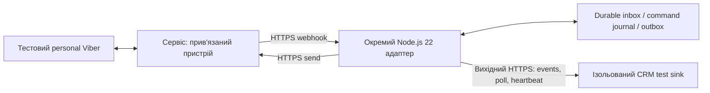

# Personal Viber для Omni: рішення після перевірки альтернатив

> **Подальший вибір користувача:** продовжити дослідження власного локального моста. Поточний план і нові GitHub-докази — у [GITHUB_REUSE_PLAN.md](GITHUB_REUSE_PLAN.md). Цей документ зберігає порівняння hosted-альтернатив; його умовна рекомендація Wazzup не є дозволом на підключення або поточним implementation plan.

Дата: **2026-09-11**. Production impact: no. Це дослідження та план, без підключення акаунтів, відправлення повідомлень, встановлення чужого коду або змін CRM.

## 1. Рекомендація

**Для швидкого надійного MVP рекомендований напрям — власний Node.js 22 адаптер до сервісу personal Viber API. Першим технічним кандидатом для пілоту обрано Wazzup User API v3; E-chat Viber API v2 — резерв.** Це вибір кандидата для перевірки, а не підтвердження працездатності сервісу або його схвалення Viber.

Вибір умовний: обидва сервіси підключають сторонній пристрій до особистого акаунта. Вони **не виконують початкову вимогу «сесія залишається тільки на машині моста»**. Дозвіл на зміну цієї межі не отримано; сам пошук альтернатив не є дозволом передати сесію. Публічного варіанта з власним локальним агентом у прочитаній документації не знайдено.

Якщо локальність сесії незмінна, рішення — **NO-GO для повного personal Omni на досліджених основах**. Не продовжувати побудову sender/transport поверх OCR і не переносити ту саму проблему на Android. Linux DB reader лишається дослідницькою зачіпкою, а не наступним обов’язковим етапом продукту. Тимчасовий робочий варіант — менеджер веде Viber вручну; повнота синхронізованої історії не обіцяється.

Причина зміни курсу: потрібне структуроване джерело адресатів і подій. У [G1](G1_REPORT.md) точний адресат через доступні UIA/Legacy поля не доведений. У [синтетичній OCR-перевірці](observer/OCR_RESULTS.md) обрізаний номер прийнято за коротший кандидат. Це конкретна небезпечна помилка адресації; додавання HTTPS-черги її не усуває. Сценарій нового контакта досі не перевірений запуском.

## 2. Короткий відбір

| Підхід | Докази та практична придатність | Рішення |
|---|---|---|
| Wazzup Personal Viber + наш адаптер | Описані номер адресата, ID, зовнішній outgoing, статуси й обмежений захист від повторів. Закрита реалізація; зовнішня сесія | **Перший пілот, якщо дозволено зовнішній сервіс** |
| E-chat Personal Viber + наш адаптер | Описані номер, окрема подія, напрямок та статуси; менше визначеності щодо повторів/відновлення. Закрита реалізація; зовнішня сесія | **Резервний кандидат** |
| Windows/macOS UIA/OCR | Особистий акаунт, але identity і повнота потоку не доведені; залежність від вікна та версії | **Зупинити як основний напрям** |
| Android Appium / notification reply | Є керування особистим застосунком або відповідь через сповіщення; немає надійного повного inbox | **NO-GO для повного Omni** |
| Linux/Android/macOS DB readers | Структуровані локальні ID справді є в коді; немає готового безпечного двостороннього мосту | **LIMITED: дослідження даних** |

### Wazzup: чому перший

Інструкція підключення використовує зареєстрований Viber-номер і QR із телефона. Початково завантажуються лише три останні діалоги; інші з’являються після нової активності. Це не повний історичний імпорт. [Підключення Viber](https://wazzup24.com/help/how-to-set-up/how-to-connect-viber-to-wazzup/).

User API v3 надсилає через `POST /v3/message`: `channelId` визначає канал, `chatType` дорівнює `viber`, `chatId` — номер цифрами. Відповідь містить `messageId`. `crmMessageId` призначений для захисту від дублювання, але розділ помилок явно обмежує перевірку **60 секундами**. Попереднє загальне формулювання на тій самій сторінці не дає підстав вважати захист безстроковим. Успішна HTTP-відповідь не доводить доставку адресату. [Send API](https://wazzup24.com/help/api-en/sending-messages/).

Webhooks описують Wazzup `messageId`, канал, номер чату, тип, час та статус; `isEcho` позначає вихідні поза цим API, наприклад із телефона. Це UUID сервісу, не доведений native Viber message ID. Є окремі статуси `sent`, `delivered`, `read`, `error`. Bearer-перевірка можлива, якщо налаштовано `crmKey`; без нього заголовка немає. Очікується HTTP 200, timeout 30 секунд. Графік повторів, строк зберігання і replay після тривалого збою на прочитаній сторінці не визначені. [Webhooks](https://wazzup24.com/help/api-en/webhooks/).

Саме конкретніший опис життєвого циклу робить Wazzup першим технічним кандидатом. Стабільність ID, повнота нового inbox і доставка **не перевірені нами запуском**. Тариф із потрібним API, умови обробки/видалення даних і доступність сервісу мають бути підтверджені до підключення тесту. Це не рекомендація оплачувати сервіс зараз.

Не змішувати User API v3 із [Tech Partner API](https://wazzup24.com/help/api/messages/): у другого інші endpoints, ID та асинхронні операції. Наявність експорту в іншій редакції не доводить replay для обраного v3.

### E-chat: резерв

[Активація](https://help.e-chat.tech/en/viber/viber-number-activation) описує номер і QR нового пристрою. [Деактивація](https://help.e-chat.tech/en/viber/viber-number-deactivation) прямо вказує на доступ сервісу до листування. [Спільна робота телефона й Desktop](https://help.e-chat.tech/en/viber/will-i-be-able-to-continue-using-viber-on-my-devices) заявлена постачальником.

У [Swagger Viber API 2.0.0](https://e-chat.tech/api/viber/v2/documentation) є connect/disconnect, `messages/send` та callback-приклади. Send містить номер свого акаунта, `contact.number` і зовнішній `message.id`. HTTP 200 означає чергу. Події мають `incoming_message`/`outgoing_message`, `message_id`, timestamp, текст/файл; статуси описані окремими кодами. Ідемпотентність зовнішнього ID, його кореляція з callback після timeout, автентифікація callbacks, retry/replay і lookup результату не визначені у прочитаній специфікації. Без цього E-chat не випереджає Wazzup.

[NetHunt](https://help.nethunt.com/en/articles/11983644-viber-integration) також документує інтеграцію personal Viber через E-chat. Це незалежне підтвердження описаного продуктового сценарію, але не наш runtime-тест. [DPA](https://e-chat.tech/en/data-processing-agreement) декларує сервери в ЄС; [умови сервісу](https://e-chat.tech/en/user-agreement) описують SaaS. Це твердження постачальника, не перевірка фактичного розміщення.

## 3. Що знайдено у відкритому коді

Наведено стан default branch на дату дослідження. Дати — останні commits, не обіцянка підтримки. В усіх рядках запуск — **не проводився**. Нуль issues не доводить відсутність дефектів.

| Проєкт / HEAD | Ліцензія, дата, середовище | Підтверджено кодом / перешкода |
|---|---|---|
| [ibjelic/viber-linux-notifications](https://github.com/ibjelic/viber-linux-notifications/commit/036756f1845c6a175bb9bc8b5dc80b270db83363) | MIT; 2026-04-03; Linux Flatpak, Qt6, C/C++; 0 forks/open issues | Query має EventID/ChatID/ContactID. Читання запускає text-hash scanner, який може не сигналізувати повтор; startup MAX(EventID) пропускає backlog. Outgoing відкидається; sender відсутній |
| [mbv06/ViberDBViewer](https://github.com/mbv06/ViberDBViewer/commit/daa7eac1e0c8fde3d14721fdc01397f447367d8a) | MIT; 2026-07-14; Kotlin/Android API26+, Java11; 0 forks/open issues | Reader імпортованої SQLite: message/conversation IDs та номер учасника. Немає live extraction і send; власний контакт визначається евристично |
| [fi3ik-mme/viber-android-automation](https://github.com/fi3ik-mme/viber-android-automation/commit/c6258fc4e904d47afe44cc8d20cd248a4131c22b) | MIT; 2026-08-05; Java21, Appium Java10.1.1, SLF4J2.0.16; 0 forks/open issues | DOM може дати номер профілю, але sender відкриває перший результат пошуку; collector зливає за текстом. Це небезпечно для однакових імен/повідомлень |
| [onrunun/notifmirror](https://github.com/onrunun/notifmirror/commit/77afb643c563ebf49cf1ae7b3490f471bd31e4c0) | GPL-3.0; 2026-09-03; Android26+, Java17, OkHttp4.12.0, macOS companion; 0 forks/open issues | RemoteInput reply до активного сповіщення; notification key/title/text, а не Viber IDs. Повнота Viber inbox і Viber-specific сумісність не доведені |
| [nemanjacosovic/viber-export-macos](https://github.com/nemanjacosovic/viber-export-macos/commit/afcea0151058b418e8895779306c5629236a4fef) | MIT; 2026-08-12; macOS, shell, LLDB/Qt; 0 forks/open issues | Debug-копія Viber, key capture та експорт DB. Не live bridge, sender відсутній; DB read-only mode не підтверджений реалізацією |

Точні code anchors:

- Linux: [daemon SQL і cursor](https://github.com/ibjelic/viber-linux-notifications/blob/036756f1845c6a175bb9bc8b5dc80b270db83363/scripts/viber-notify#L73), [text hash trigger](https://github.com/ibjelic/viber-linux-notifications/blob/036756f1845c6a175bb9bc8b5dc80b270db83363/src/viber_mem_watch.c#L273), [QSQLITE query](https://github.com/ibjelic/viber-linux-notifications/blob/036756f1845c6a175bb9bc8b5dc80b270db83363/src/viber_query.cpp#L53). Наявність DB ID корисна, але completeness потребує іншого durable cursor loop.
- Android DB: [message/conversation/number](https://github.com/mbv06/ViberDBViewer/blob/daa7eac1e0c8fde3d14721fdc01397f447367d8a/app/src/main/java/com/mbv/viberdbviewer/data/AndroidViberDatabaseReader.kt#L46), [евристика self](https://github.com/mbv06/ViberDBViewer/blob/daa7eac1e0c8fde3d14721fdc01397f447367d8a/app/src/main/java/com/mbv/viberdbviewer/data/AndroidViberDatabaseReader.kt#L183). IDs локальні; сталість після relink/перевстановлення не встановлена. [Формат undocumented](https://github.com/mbv06/ViberDBViewer/blob/daa7eac1e0c8fde3d14721fdc01397f447367d8a/docs/viber-database.md); точні сумісні версії Viber не доведені.
- Appium: [first result → send](https://github.com/fi3ik-mme/viber-android-automation/blob/c6258fc4e904d47afe44cc8d20cd248a4131c22b/src/main/java/viber/automation/scenarios/SendMessageScenario.java#L41), [text-only key](https://github.com/fi3ik-mme/viber-android-automation/blob/c6258fc4e904d47afe44cc8d20cd248a4131c22b/src/main/java/viber/automation/service/ParsedMessagesMergeProcessor.java#L640). [Налаштування upstream](https://github.com/fi3ik-mme/viber-android-automation/blob/c6258fc4e904d47afe44cc8d20cd248a4131c22b/src/main/resources/viber.properties#L8) вмикають автопублікацію DB у GitHub Pages за наявності відповідної конфігурації; не запускати його на робочих даних.
- Notifications: [extract fields](https://github.com/onrunun/notifmirror/blob/77afb643c563ebf49cf1ae7b3490f471bd31e4c0/android/app/src/main/kotlin/com/notifmirror/android/service/NotificationExtractor.kt#L36), [dedup і RemoteInput](https://github.com/onrunun/notifmirror/blob/77afb643c563ebf49cf1ae7b3490f471bd31e4c0/android/app/src/main/kotlin/com/notifmirror/android/service/MirrorListenerService.kt#L75). Android [notification key](https://developer.android.com/reference/android/service/notification/StatusBarNotification#getKey()) не є ID Viber-повідомлення. Reply action не є підтвердженням доставки.
- macOS: [export implementation](https://github.com/nemanjacosovic/viber-export-macos/blob/afcea0151058b418e8895779306c5629236a4fef/viber-export-macos.sh#L370). Наявність plaintext export не доводить придатність до постійного приватного збору.

Ще відсіяно: [usix-companion](https://github.com/yanghoeg/usix-companion/blob/e307bb01ca8283b959ecc3860f16933e2fc85d15/app/src/main/java/dev/usix/companion/NotifStore.kt#L31), 2026-09-02, без LICENSE, RAM-буфер notifications із заміною за key. [RegionallyFamous/mautrix-viber](https://github.com/RegionallyFamous/mautrix-viber/blob/5b2fb19ec879e7efee349ad02a803650ea050633/internal/viber/send.go#L160) та fork `directentis1/mautrix-viber` мають однаковий HEAD від 2025-11-11: це **Bot API**. README заявляє MIT, [LICENSE](https://github.com/RegionallyFamous/mautrix-viber/blob/5b2fb19ec879e7efee349ad02a803650ea050633/LICENSE) не підтверджує цю заяву. [Chat2Desk](https://chat2desk.com/en/knowledge-base/connecting-channel-and-messengers/manuals/how-to-connect-viber-public) і [Umnico](https://umnico.com/ru/integrations/viber/) також описують bot-підключення; вони не замінюють personal account. Офіційний [Viber Bot API](https://developers.viber.com/docs/api/rest-bot-api/) поза вимогами.

Початкові rusty4444/wawimundo, їхні залежності, issues і форки залишаються в [RESEARCH.md](RESEARCH.md). Цей відбір розширює попередній пошук; не доводить відсутність будь-якого приватного або неіндексованого рішення.

## 4. Мінімальна архітектура умовного API-пілоту

Це проєкт нашої системи, не опис уже реалізованих гарантій постачальника.

Умовна зміна межі: сесією володіє провайдер; адаптер потребує публічного HTTPS callback. Його можна розмістити окремим сервісом після дозволу на інфраструктуру; зв’язок адаптер→CRM лишається вихідним HTTPS. Поточний Windows worker із суто вихідними з’єднаннями цього не реалізує. [BRIDGE_CONTRACT.md](BRIDGE_CONTRACT.md) лишається контрактом локального варіанта; підміна архітектури без явної нової редакції заборонена.

Для наступної редакції контракту зберегти такі вимоги:

- Реєстр на сервері прив’язує credential до одного `bridge_id`/`account_id`/business, provider та дозволеного channel. PARK/DAR не визначаються довільним полем callback. Новий номер чи relink потребує перевірки account binding; UUID каналу не є довічною identity людини.
- Різні простори ID: наші `event_id`, `command_id`, `client_request_id`; окремо `provider`, `provider_account_id`, `provider_message_id`. Усі зовнішні ID зберігати рядками. Ім’я — display-only; номер і ID є твердженнями провайдера, доки зв’язок із тестовим адресатом не перевірено.
- Спочатку перевірити callback і durable-записати подію, потім ACK. Відправляти в CRM до її durable ACK. Message, status та edit мають окремі типи/ключі; dedup за самим message ID не повинен поглинути status update. Ніколи не зливати повідомлення за текстом.
- Команду та payload hash записати до зовнішнього HTTP. Повтор того самого ID повертає поточний стан; інший payload із тим самим ID відхиляється. На акаунт один sender; durable lease не дозволяє паралельний dispatch.
- Перед HTTP durable-позначити спробу. Timeout/crash після цієї межі → `unknown`, без автоматичного повтору навіть після 60 секунд або restart. Відновлювати статус тільки через доведену кореляцію з провайдером. Схожий текст/час — недостатній доказ. Якщо немає lookup/correlation, невизначеність лишається видимою менеджеру.
- `accepted`, `sent` і `delivered` різні. Provider-reported delivery зберігати з джерелом доказу; HTTP 2xx/бульбашка не підвищують статус до delivered. Пізній підтверджений status може уточнити unknown, не спричиняючи send.
- Події телефона/Desktop відображаються в історії; не створюють нових команд. Автовідповідей немає. API echo/status приєднується до початкової команди за доведеним ID.
- Окремо показувати process heartbeat, channel connection, last persisted event і verified inbound probe. Тиха розмова не означає несправність, а живий HTTP-процес не доводить приймання.

Медіа API описують, але в цьому пілоті capabilities `send_photo`, `send_pdf`, `history_backfill` залишаються false. Посилання на файл не доводить доступність оригіналу, строк життя або фактичну доставку. Черга адаптера захищає тільки вже отримані події: пропуски до webhook потребують replay провайдера.

## 5. Пілот із чітким завершенням

**Передумова:** власник погодив зовнішню сесію, обраний тариф дає потрібний API, погоджено умови зберігання/видалення даних. Без цього не реєструвати сервіс і не сканувати QR. Постачальникам у цьому дослідженні повідомлень не надсилали.

**Ресурси:** окремий тестовий номер A з телефоном і Viber; три керовані тестові співрозмовники B/C/D із різними номерами; B/C з однаковими назвами, D раніше не писав A. Поточний Windows Desktop можна використати для звірки outbound, окремий постійно активний ПК для hosted-сесії не планується. Потрібен погоджений HTTPS test endpoint, Node22/npm10, ізольоване durable storage поза repo/OneDrive, керований fault proxy та журнал тільки synthetic test IDs. Реальні номери/секрети в документацію не потрапляють. Не купувати Android-парк, Mac або емулятори для цього відбору.

| Крок | Перевірка | Умова проходження |
|---|---|---|
| 1. Контракт до підключення | Підтвердити API edition, auth callbacks, retention/retry/replay; кореляцію timeout за client ID; поведінку relink; доступність у потрібному тарифі | Відповіді/документація зафіксовані. Непідтверджені можливості не оголошуються підтримуваними |
| 2. Мінімальний test harness | Лише text, inbox/ACK і command journal; crash до/після запису; повтор command ID з однаковим/іншим payload | Повтор не спричиняє зовнішнього POST; після crash in-flight переходить у unknown. Спочатку синтетичні локальні перевірки |
| 3. Адресати й новий inbound | B/C: 30 адресованих проб у змінному порядку, перейменування; D першим пише A; B надсилає два однакові тексти підряд | Нуль помилкових адресатів; D виявлено без pairing; обидва однакові повідомлення мають різні подієві ID |
| 4. Синхронізація й збої | Outgoing з API/телефона/Desktop; timeout send; повтор після >60 секунд і restart; втрачений callback ACK; endpoint offline; relink/offline Viber | Жодного автоповтору send/echo; відновлення всіх очікуваних подій або явно зафіксований gap. Unknown не маскується під delivered |
| 5. Рішення | Контрольоване спостереження протягом 24 годин із inbound probes; порівняння журналу тестів з received IDs; перевірка відключення linked device | Таблиця PASS/FAIL/NOT RUN; нуль помилкових адресатів, дублів і невиявлених втрат у тестах. Це доказ обмеженого пілоту, не гарантія безвідмовності |

Бюджет планування: до двох робочих днів підготовки/активних перевірок плюс 24 години спостереження після доступу до API й тестових акаунтів. Якщо крок 1 не закривається — не будувати CRM UI, перейти до E-chat з тією самою матрицею. Якщо обидва не дають правильної адресації або нового inbound — завершити відбір **NO-GO**, не починати черговий UI/OCR цикл. Якщо replay не доведений — максимум **LIMITED**, з явним ризиком пропущеної історії.

Після успішного пілоту — окреме рішення про нову редакцію контракту та інтеграційний реліз CRM. На цьому етапі не потрібні production QA, міграції, залежності CRM або Railway settings.

## 6. Рівні доказів і фінальний статус

- **Заявлено автором/постачальником:** hosted personal activation, API semantics, синхронізація, media, умови сервісів. Прочитано первинні документи; виконання не підтверджено.
- **Підтверджено кодом:** перелічені OSS readers, UI send paths, text dedup, notification reply та їхні обмеження на pinned SHA. Закритий код провайдерів недоступний.
- **Перевірено запуском раніше:** власний обмежений Windows observer і синтетичний OCR, див. G1/OCR звіти. Це не runtime-перевірка чужих проєктів.
- **Не перевірено:** робота Wazzup/E-chat на тестовому номері, new-contact intake, сталість ID, media, replay, delivery receipts, disconnect/reconnect.

**Поточний статус: LIMITED для умовного API-пілоту; NO-GO для повного локального Personal Bridge на досліджених основах. GO для production немає. Рекомендована наступна дія після погодження зовнішньої сесії — один обмежений Wazzup API-пілот за кроками вище.**
