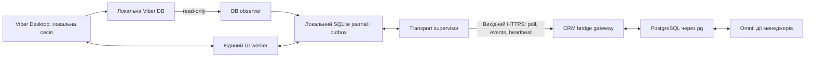

# Viber Personal Bridge — protocol 1.0

Статус: **проєкт контракту**, 2026-09-11. Не реалізований API EventGenix і не опис можливостей кандидатів. Нормативні слова MUST / MUST NOT / SHOULD визначають вимоги до майбутнього прототипу. Усі JSON нижче синтетичні; ідентифікатори не належать реальним акаунтам. Докази обмежень: [RESEARCH.md](RESEARCH.md). Gate перевірки: [PROTOTYPE_PLAN.md](PROTOTYPE_PLAN.md).

**Оновлення G2/G3/P1:** [локальний Qt/SEE schema reader перевірено запуском](G2_REPORT.md); додано окремий marker-only observer і durable journal для локального тестового consumer — [G3](G3_REPORT.md). Локальний `observer/p1_bridge_core.py` реалізує синтетично перевірений fail-closed identity/command ledger, але ще не підключений до Viber UI або CRM. HTTPS transport і CRM ACK відсутні. `source_message_ids`, повний inbox і send capabilities не вмикаються через синтетичні тести: стабільність source IDs/relations і адресат потребують контрольних Viber-подій. G3 run ID не є production bridge/account ID; локальний HMAC каталогу не доводить автентичність акаунта, а file identity не дорівнює provider epoch.

Подальший G3 SID run підтвердив дві distinct DUP події одного локального чату, dedup між fresh readers і durable local ACK. Це вузький actual proof, не заявка на весь inbox. `ChatInfo.Token` у цих observations відсутній; future adapter MUST NOT вимагати його універсальної наявності або без доказу називати provider chat ID. Результат не вмикає `send_text`, `recipient_verified`, глобальне new-contact coverage або provider delivery receipts.

## 1. Архітектура і межі довіри

Попередній G3 виявив recovery risk після втрати тимчасового PRAGMA-параметра. [Новий SID bootstrap](KEY_ORIGIN_REPORT.md) уже пройшов read-only schema recovery на точному Windows build без restart/RAM scan. Це не робить сам SID ідентифікатором Viber-акаунта: під одним Windows user можуть послідовно існувати різні Viber sessions. SID, static-prefix material і похідний DB key MUST залишатися локальними, не передаватися в protocol/logs/CRM і не замінювати enrollment/account binding.

Наявна baseline/живий supervisor не означають працездатного приймання. За `CANDIDATE_UNAVAILABLE`, binary mismatch або невдалого schema read transport має передавати receive-unhealthy й не підтверджувати inbox progress; події та cursor не скидаються. Жодного автоматичного rekey або fallback до довільного RAM/config scan. Recovery після зміни Viber version/session, crash і actual inbox потребують своїх gates. [Контрольний звіт](G3_REPORT.md).

Окремий [лабораторний listener](G3_LISTENER_REPORT.md) уже перевірив довше з'єднання на synthetic DB через встановлений Qt plugin. Його JSONL heartbeat — локальна діагностика, **не цей HTTPS-протокол**: `worker_alive` і `source_poll_healthy` окремі, `inbound_verified=false`. Це не нова production capability і не live inbox proof.

Додатковий [encrypted SEE WAL fixture](RECOVERY_RESEARCH.md) підтвердив три polls і дві distinct synthetic події на одній READONLY connection після одноразового подання ключа; fresh keyless read не пройшов. Це не доводить автоматичний recovery або actual inbox. Після втрати connection `source_poll_healthy` лишається false до нового успішного open/read; synthetic evidence не може змінювати `inbound_verified` або capabilities.



На Windows — окрема програма в тій самій інтерактивній user session, що й Viber. Пропонований runtime — Python 3.12 x64 для Windows UIA і stdlib sqlite3/HTTPS; залежності UIA фіксуються після review у наступному етапі. В CRM лишається Node.js 22 / Express / pg. Matrix, LLM і MCP не потрібні для виконання команд. Автовідповіді заборонені; inbound і зовнішній outbound не мають запускати send.

Усі операції Desktop — discovery, navigation, read, clipboard, send, diagnostics — проходять одну локальну чергу й одного UI worker. Named OS mutex на Viber user session не допускає другого worker/supervisor; heartbeat/HTTPS не беруть UI lock. `operator_pause` спочатку зупиняє intake UI operations і чекає quiescence, лише потім передає Desktop людині. Lock не контролює телефон або сторонній фізичний input. Перевірка перед click не є атомарною транзакцією з Viber: тому виділена session та intrusion tests обов’язкові, а observed focus/identity change блокує Send.

Bridge сам відкриває HTTPS до фіксованого CRM origin. Команди повертаються у відповідь на outbound long poll; відкритих inbound портів/тунелів на Windows немає. TLS перевіряє certificate/hostname; TLS ≥1.2, без insecure overrides і cross-origin redirects. Bridge працює без Viber-пароля/token у CRM: session, QR activation та локальна Viber DB залишаються на bridge host. Події несуть лише погоджений зміст тестового/майбутнього робочого діалогу, не копію session.

Provisioning видає окремий сильний bearer credential у заголовку Authorization, зберігається через Windows Credential Manager/DPAPI; у CRM — verifier, не plaintext у логах. Реєстраційні endpoints не є частиною цього прототипу. Credential server-side прив’язаний до `(bridge_id, account_id, business_context, account_epoch)`. Payload не може перевизначити цю прив’язку. Для PARK ключ `event_genix`, для DAR — `dar`; порожні, чужі чи невідомі значення відхиляються, без default PARK. Лише права events-write / own-command-read / own-result-write / heartbeat; без адміністративного доступу до CRM.

Компрометація Windows host означає компрометацію його Viber session і bridge credential; HTTPS не змінює цю межу довіри. Скасування bridge credential зупиняє його CRM-операції, але не є logout Viber. DB спула міститиме message content: тільки приватний каталог профілю поза repo/OneDrive, ACL одного service-user, encrypted disk; snapshots/screenshots за замовчуванням вимкнені.

## 2. Версіонування, транспорт і ACK

`protocol_version` — `MAJOR.MINOR`, у цій версії `1.0`. Major mismatch → 426 `PROTOCOL_UNSUPPORTED`, send вимкнений. Minor узгоджується при session/open як максимальна спільна версія. Нові необов’язкові поля ігноруються, невідомі типи команд, enum або required capability відхиляються. Capabilities можуть лише знижувати доступні операції; назва backend чи версія пакета не вмикає їх автоматично.

Кожна durable подія має envelope із protocol, type, bridge/account/epoch/business, runtime_id, event_id, sequence та observed_at. Sequence зростає в межах bridge/account/epoch і не скидається при restart runtime. Для `chat.discovered`/`observation.ambiguous` допустимі `chat_id=null`, локальний `candidate_id` і `identity.level=unresolved`; для `capture.gap` — `from_observed_at`, `to_observed_at`, `chat_id` або account-wide coverage і reason. Ці типи проходять той самий outbox/ACK, але не створюють вигаданого нормалізованого повідомлення.

Реалізовані endpoints CRM v1:

| Запит від bridge | Відповідь / призначення |
|---|---|
| `POST /api/omni/bridge/v1/heartbeat` | Protocol/capabilities, server time і lease одного активного runtime |
| `POST /api/omni/bridge/v1/commands/pull` | Список команд свого bridge/account/epoch; видача не підтверджує виконання |
| `POST /api/omni/bridge/v1/commands/:command_id/result` | `dispatch_started` або terminal result; endpoint не запускає повторний send |
| `POST /api/omni/bridge/v1/events` | Durable CRM ACK конкретних `event_id` після обробки або дедуплікації |

Authorization передається header, ніколи URL/query. Credential і точний
`bridge_id/account_id/account_epoch/business_context` перевіряються на кожному
запиті. Heartbeat — кожні 15 s; server lease — 90 s. Другий runtime під час
активного lease отримує 409 `BRIDGE_ALREADY_ACTIVE`. Після takeover старий
runtime отримує 409 `BRIDGE_RUNTIME_INACTIVE` на events, command pull і result.
Lease expiry забороняє нові CRM send; уже розпочата зовнішня дія може мати
результат `unknown`. Viber не має транзакційного fencing, тому локальний named
mutex та один UI worker залишаються обов'язковими.

JSON UTF-8; усі timestamps — RFC3339 UTC. `observed_at` є часом host, не часом отримання Viber. Порядок event задає durable `sequence` (decimal string, щоб уникнути JavaScript integer overflow), а не годинник. У MVP: text ≤4000 Unicode code points і ≤16 KiB UTF-8, packet ≤256 KiB, events batch ≤50, commands batch ≤10. Це локальні захисні межі прототипу, не заявлені ліміти Viber. Invalid size → відхилення до UI.

Transport retries: exponential backoff 1/2/4/8/16/30 s + jitter, `Retry-After` для 429/503, той самий event/command identity. Network failure, timeout або втрачений HTTP response не є ACK. CRM віддає event ACK **тільки після transaction commit** inbox + normalized record/result update. 200 від reverse proxy без валідного body не вважається ACK. Poison event з 422 зберігається локально в quarantine, не видаляється і не блокує інші валідні event IDs.

## 3. Identity та достовірність полів

| Поле | Власник / джерело | Гарантія |
|---|---|---|
| `bridge_id` | CRM-issued UUID при provisioning | Достовірна identity bridge installation; не Viber account ID |
| `account_id` | CRM-issued UUID, ручна прив’язка одного тестового номера | Достовірна identity запису CRM; зв’язок із запущеним Viber потребує окремої локальної перевірки |
| `account_epoch` | CRM integer, підвищується при rebind/reset | Старі commands не виконуються в новій session/account generation |
| `runtime_id` | Випадковий UUID при кожному старті supervisor | Process generation, не привід очистити dedup |
| `business_context` | Server-side credential binding | `event_genix` або `dar`, незмінний у session |
| `chat_id` | Durable UUID bridge registry у межах account/epoch | Стабільний локальний ключ після restart; сам UUID не доводить Viber identity |
| `peer_ref` | Opaque локальний registry key | Зберігає verified locator/номер поза logs; не display name |
| `binding_revision` | Монотонний integer registry | Змінюється при зміні/повторній перевірці locator; stale command відхиляється |
| `provider_account_id`, `provider_chat_id`, `provider_message_id` | Тільки фактично доступні provider identifiers | Для поточних UIA/OCR кандидатів — `null`; не підставляти UIA RuntimeId, координати або hash тексту. Локальний DB EventID не називати глобальним provider_message_id |
| `display_name` | UIA/OCR/ручний label | Mutable hint, не key, не причина auto-merge |
| `direction` | Source marker або геометрія | `inbound`, `outbound`, `unknown`; геометрія позначається heuristic |
| `origin` | Кореляція command або спостереження own-account message | `crm_command`, `external_viber`, `unknown`; phone vs Desktop зазвичай невідомо |
| `text` | UIA ValuePattern або OCR | UIA — прочитаний UI text, не повний provider payload; OCR — heuristic |
| `provider_timestamp` | Тільки читаємий timestamp | `null`, якщо недоступний/неоднозначний; локалізовану дату не вгадувати |
| `event_id`, `sequence`, `command_id`, `client_request_id` | Наш durable transport/CRM | Достовірні application IDs; не receipt і не доказ відсутності source gaps |

Номер телефона не є вічним provider identity: можливі зміна номера, re-registration і повторна видача. Чат не зливається за номером між account_epoch/business. У v1 групи, communities і hidden chats не допускаються до Send.

Для DB adapter доведено **тільки наявність колонок** `Events.EventID/ChatID/ContactID/TimeStamp/Direction`, `Messages.EventID/Body`, `Contact.ContactID/Number`, `ChatInfo.ChatID/Token`. Після окремої перевірки значень локальні source references MUST мати namespace і database epoch та бути прив’язаними до credential-bound account/business. Ні MAX(EventID), ні шлях каталогу, ні найчастіший outgoing contact не є доказом власника акаунта. `EventID > cursor` не є change feed для edits/deletions/receipts/late hydration; потрібен reconciliation. Читання `Contact.Number` не підтверджує peer активного UI-чату. Поточні capability examples нижче лишаються консервативними до проходження цих gates.

### Gate правильного адресата

`identity.level`: `verified_locator`, `operator_bound`, `heuristic`, `unresolved`. Для unattended Send потрібен `verified_locator`: локальна прив’язка тестового акаунта + незалежно прочитаний номер/стійкий peer key саме з відкритого chat/profile, звірений із registry у цій операції. Сам введений deep link, display name, avatar, відсутність error screen або видимий composer недостатні.

`operator_bound` дозволяє read-only лабораторну прив’язку, але **не remote Send**. Якщо потрібного locator у Viber немає, bridge лишається manual-assist, capability `send_text=false`. Це блокер, а не поле, яке можна заповнити UUID і вважати вирішеним. Після restart/logout/account switch identity gate виконується знову; недоступна account verification → `ACCOUNT_UNVERIFIED`. Сама наявність процесу Viber не підтверджує login.

## 4. Durable events: inbound, external outbound, gaps

Спочатку worker атомарно записує локальні observation, event_id, sequence та просування capture cursor у SQLite transaction, після commit повідомляє transport. До durable ACK CRM подія залишається в outbox. Unacked content не видаляється за TTL; при дисковій помилці нові send зупиняються, capture позначається degraded і створюється gap після відновлення. Пропозиція ліміту спула: 100 MiB для текстового тесту; до заповнення підняти діагностику. Після ACK payload може очищатися за погодженою retention, tombstone event_id/hash лишається.

CRM має unique `(bridge_id, account_id, account_epoch, event_id)`. Повтор із тим самим canonical content повертає `duplicate`; той самий ID з іншим content → 409 `EVENT_CONFLICT`. ACK не накопичувальний: підтверджує тільки перелічені IDs, а не всі sequence менші за останній. Пропуск sequence видно в diagnostics, але сервер не відкидає out-of-order подію.

Два однакові тексти — два occurrence, два event_id. **Текстовий hash не використовується як event identity.** На UIA/OCR snapshot потрібне послідовне зіставлення з overlap, occurrence ordinal та стійкими anchors. Це евристика: якщо дві історії спостережень нерозрізненні, worker створює `capture.gap`/`observation.ambiguous`, не приховує втрату і не заявляє lossless ingestion. Durable outbox гарантує доставку лише вже захоплених подій.

### Inbound example

```json
{
  "protocol_version": "1.0",
  "type": "message.observed",
  "bridge_id": "00000000-0000-4000-8000-000000000001",
  "account_id": "00000000-0000-4000-8000-000000000002",
  "account_epoch": 1,
  "business_context": "event_genix",
  "runtime_id": "00000000-0000-4000-8000-000000000003",
  "event_id": "00000000-0000-4000-8000-000000000101",
  "sequence": "101",
  "observed_at": "2026-09-11T09:00:00Z",
  "chat_id": "00000000-0000-4000-8000-000000000010",
  "binding_revision": 1,
  "peer_ref": "peer-test-a",
  "identity": {
    "level": "operator_bound",
    "provider_account_id": null,
    "provider_chat_id": null,
    "display_name": "Test Contact A"
  },
  "message": {
    "provider_message_id": null,
    "direction": "inbound",
    "origin": "unknown",
    "content_type": "text",
    "text": "Synthetic inbound 001",
    "provider_timestamp": null,
    "command_id": null,
    "client_request_id": null
  },
  "evidence": {
    "text_source": "uia_value",
    "direction_source": "geometry_heuristic",
    "occurrence_source": "viewport_overlap_heuristic",
    "completeness": "partial",
    "delivery_confirmation": "none"
  }
}
```

`type=message.observed` однаковий для inbound і observed outbound; це усуває потребу перетворювати own-message на inbound. `external_viber` означає спостережений own-account outbound без доказового зв’язку з CRM command; device не вигадується. Ці events ніколи не перетворюються на команду Send і не запускають AI/reply automation.

Тільки надійна кореляція з command дозволяє оновити вже наявне CRM-повідомлення замість додавання echo. Збіг тексту/часового вікна є лише candidate correlation, не причина видалити inbound або external outbound. За неоднозначності окрема observation отримує `origin=unknown`; її можна показати як нерозібрану подію, не auto-merge. Менеджер має бачити, що історія неповна/неоднозначна.

### Event ACK example

```json
{
  "protocol_version": "1.0",
  "bridge_id": "00000000-0000-4000-8000-000000000001",
  "account_id": "00000000-0000-4000-8000-000000000002",
  "account_epoch": 1,
  "business_context": "event_genix",
  "acknowledgements": [
    {
      "event_id": "00000000-0000-4000-8000-000000000101",
      "status": "persisted",
      "crm_record_id": "test-observation-101"
    }
  ],
  "committed_at": "2026-09-11T09:00:01Z"
}
```

Статуси ACK: `persisted`, `duplicate`, `quarantined`. `quarantined` може дозволити видалення локального payload лише якщо CRM уже зберегла повний event у durable quarantine; validation rejection таким ACK не є. Невідомі контакти: `chat.discovered` з candidate_id і `identity.level=unresolved`, без автоматичного customer link. До однозначного встановлення peer — quarantine. Відсутність такого discovery у backend → capability false, а не вигаданий chat_id.

## 5. Send command, idempotency та стан виконання

Команду створює **менеджер CRM**. CRM спочатку durable-зберігає command і його зв’язок із власним outbound record, потім віддає bridge. Один логічний запит менеджера має незмінний `client_request_id`, один незмінний `command_id`. Ідемпотентність scoped по account/epoch/business, а не по імені/тексту/HTTP-сесії.

```json
{
  "protocol_version": "1.0",
  "type": "message.send",
  "bridge_id": "00000000-0000-4000-8000-000000000001",
  "account_id": "00000000-0000-4000-8000-000000000002",
  "account_epoch": 1,
  "business_context": "event_genix",
  "command_id": "00000000-0000-4000-8000-000000000201",
  "client_request_id": "00000000-0000-4000-8000-000000000301",
  "created_at": "2026-09-11T09:01:00Z",
  "expires_at": "2026-09-11T09:06:00Z",
  "target": {
    "chat_id": "00000000-0000-4000-8000-000000000010",
    "peer_ref": "peer-test-a",
    "binding_revision": 2,
    "required_identity": "verified_locator"
  },
  "content": {
    "type": "text",
    "text": "Synthetic manager reply 001"
  },
  "requested_by": {
    "kind": "manager",
    "crm_user_id": "test-manager-1"
  }
}
```

Синтетичний приклад припускає, що binding revision 2 вже пройшов gate; це не твердження, що прочитані кандидати його проходять. Команда не містить shell commands, scripts, file paths, raw UI selectors або довільних URLs. Peer locator береться з локального registry за target, не з назви в body. Непорожній чужий draft → `DRAFT_PRESENT`, його не очищують автоматично.

### Durable прийняття

До ACK bridge атомарно робить insert journal з unique command_id і client_request_id, semantic payload hash, state `accepted`. Hash — SHA-256 canonical JSON бізнес-полів (target, exact text, actor, scope, created/expires); фіксований порядок keys/UTF-8, без trimming або Unicode normalization. Transport metadata/runtime lease до hash не входять.

```json
{
  "protocol_version": "1.0",
  "bridge_id": "00000000-0000-4000-8000-000000000001",
  "account_id": "00000000-0000-4000-8000-000000000002",
  "account_epoch": 1,
  "business_context": "event_genix",
  "command_id": "00000000-0000-4000-8000-000000000201",
  "client_request_id": "00000000-0000-4000-8000-000000000301",
  "status": "accepted",
  "durable": true,
  "accepted_at": "2026-09-11T09:01:01Z"
}
```

`accepted` тут означає лише **записано bridge**, не provider accepted. Повторна видача тієї самої команди повертає існуючий стан/result, не нову UI operation. Той самий command_id з іншим semantic payload → `COMMAND_CONFLICT`. Новий command_id із уже використаним client_request_id → `CLIENT_REQUEST_CONFLICT`, із посиланням на оригінальний command_id; навіть ідентичний текст не виконується вдруге. Ці перевірки дублюються CRM і bridge.

### State machine

```text
received -> accepted -> preparing -> dispatch_started -> submitted_unconfirmed
                                 \                   \-> unknown
                                  -> rejected_before_dispatch
accepted/preparing -> expired_before_dispatch
```

`preparing` може робити focus/navigation/read/clipboard, але не Send. Перед Send worker повторно перевіряє account_epoch, identity, binding_revision, foreground process/window, geometry/version, draft, lease та deadline. У journal MUST commit `dispatch_started` **до** будь-якої дії, здатної надіслати повідомлення. Один send gesture; fallback Enter після непевного click заборонений.

- Restart у `accepted/preparing`: можна продовжити лише якщо durable journal доводить, що dispatch не починався, попередній worker зупинений, draft/identity повторно перевірені, команда не expired. Це продовження до першої Send-спроби, не resend.
- Restart у `dispatch_started`: `unknown` незалежно від того, чи crash був перед фізичним click або після нього. Немає атомарної transaction між SQLite і Viber UI.
- Timeout coroutine не є зупинкою UI thread. Supervisor блокує чергу, зупиняє окремий UI worker process, чекає підтвердженого завершення і перевіряє Desktop перед новими операціями. Без доказу quiescence — `UI_WORKER_STUCK`, Send вимкнений. Cancellation не скасовує вже прийняті Viber input events.
- `submitted_unconfirmed`: наша єдина UI operation завершилась, composer/bubble observation збережена, delivery все ще unknown. `unknown`: неможливо встановити, чи operation завершилась. **Обидва terminal для автоматичного dispatch; повторного Send немає.**
- Timeout HTTP command ACK/result upload не запускає новий dispatch. Уже збережений result повторно передається через outbox.
- `rejected_before_dispatch`/`expired_before_dispatch`: журнал доводить відсутність Send-спроби. Той самий command не перезапускається; менеджер може створити новий після усунення причини.

Жодного загального exactly-once promise для Viber. Гарантія — **не більше однієї Send-спроби для команди в межах збереженого журналу**. Компроміс у crash window — можливе ненадсилання з unknown замість ризику дубля.

### Unknown result example

```json
{
  "protocol_version": "1.0",
  "type": "command.result",
  "bridge_id": "00000000-0000-4000-8000-000000000001",
  "account_id": "00000000-0000-4000-8000-000000000002",
  "account_epoch": 1,
  "business_context": "event_genix",
  "runtime_id": "00000000-0000-4000-8000-000000000003",
  "event_id": "00000000-0000-4000-8000-000000000102",
  "sequence": "102",
  "observed_at": "2026-09-11T09:01:20Z",
  "command_id": "00000000-0000-4000-8000-000000000201",
  "client_request_id": "00000000-0000-4000-8000-000000000301",
  "result_revision": 1,
  "outcome": "unknown",
  "dispatch_attempts": 1,
  "provider_message_id": null,
  "provider_accepted": null,
  "delivery_status": "unknown",
  "delivery_confirmed": false,
  "evidence": {
    "dispatch_started_durable": true,
    "ui_send_invoked": true,
    "bubble_observed": false,
    "recipient_receipt": null
  },
  "error": {
    "code": "SEND_OUTCOME_UNKNOWN",
    "phase": "post_dispatch",
    "retry_safe": false,
    "message": "UI observation timed out after send invocation"
  }
}
```

Для штатно завершеної UI operation поля можуть бути `outcome=submitted_unconfirmed`, `bubble_observed=true`, `error=null`; `provider_accepted=null`, `delivery_status=unknown`, `delivery_confirmed=false` лишаються. Acknowledgement CRM на цей event теж не є доставкою співрозмовнику.

Протокол резервує `receipt.observed` для майбутнього capability із message-linked evidence. У v1 `delivery_receipts=false`; bridge MUST NOT присилати `delivered/read`. Навіть видимий tick без перевіреної семантики й correlation — тільки UI observation. Оператор може окремо записати `operator_resolution` після перевірки на тестовому телефоні адресата; оригінальний result не переписується. Якщо менеджер свідомо хоче ще одне повідомлення після unknown, потрібні нові IDs і `supersedes_command_id` із явним усвідомленням ризику дубля; автоматичного варіанта такої дії немає.

## 6. Heartbeat і capabilities

Heartbeat обслуговує supervisor окремо від blocking UI worker. Він доводить, що працює transport, а не приймання Viber. `last_scan_completed_at` оновлюється лише після валідної перевірки reader, а не після запуску polling timer. У silent inbox timestamp останнього повідомлення може бути старим при справному reader; і навпаки, новий heartbeat не скасовує stale scan.

```json
{
  "protocol_version": "1.0",
  "type": "bridge.heartbeat",
  "bridge_id": "00000000-0000-4000-8000-000000000001",
  "account_id": "00000000-0000-4000-8000-000000000002",
  "account_epoch": 1,
  "business_context": "event_genix",
  "runtime_id": "00000000-0000-4000-8000-000000000003",
  "observed_at": "2026-09-11T09:02:00Z",
  "uptime_seconds": 120,
  "transport": { "state": "connected", "outbox_pending": 0 },
  "account": { "session_state": "locally_confirmed", "provider_verified": false },
  "desktop": { "state": "locked", "worker_busy": false, "viber_build": null },
  "receive": {
    "state": "blocked",
    "coverage": "paired_chats_only",
    "last_scan_completed_at": "2026-09-11T09:00:40Z",
    "last_message_observed_at": "2026-09-11T09:00:00Z",
    "last_controlled_receive_test_at": null,
    "paired_chats": 3,
    "chats_scanned_last_cycle": 3,
    "known_gap": true,
    "reason": "DESKTOP_LOCKED"
  },
  "capabilities_revision": 1,
  "capabilities": {
    "observe_text": true,
    "send_text": false,
    "stable_peer_identity": false,
    "unknown_contact_discovery": false,
    "external_outbound_capture": false,
    "source_message_ids": false,
    "attachment_receive": [],
    "attachment_send": [],
    "full_history": false,
    "delivery_receipts": false,
    "groups": false,
    "receive_while_locked": false
  }
}
```

Наведено навмисно degraded синтетичний стан. Реальні capabilities встановлюються за записаними результатами gates для конкретного build, не копіюванням прикладу. Стан `receive=ready` дозволений лише при актуальному успішному scan та відсутності blocker; coverage лишається окремою. При paired-only coverage UI MUST явно показувати, що нові звернення поза реєстром не приймаються.

Прототипні thresholds: 45 s без heartbeat → transport stale; 90 s без успішного повного scan трьох paired chats → receive stale. Ці величини тестові й вимірюються під навантаженням. `last_controlled_receive_test_at` оновлюється після ручного контрольного inbound із другого тестового акаунта, не після автоматичного self-send. Бот-автовідповідь для health check не потрібна.

## 7. Помилки, recovery і retention

| Код / ситуація | Статус і дія |
|---|---|
| `AUTH_INVALID` / `AUTH_REVOKED` (401), `SCOPE_MISMATCH` (403) | Зупинити command intake/send; зберегти outbox; ручний provisioning. Не fallback на загальний CRM token |
| `PROTOCOL_UNSUPPORTED` (426), `CAPABILITY_UNSUPPORTED` (422) | Send disabled; узгодити сумісний protocol/backend. Фото/PDF не деградують мовчки в текст |
| `COMMAND_CONFLICT`, `CLIENT_REQUEST_CONFLICT`, `EVENT_CONFLICT` (409) | Зберегти original, відхилити mutation, operator diagnostic; без send |
| `ACCOUNT_UNVERIFIED`, `ACCOUNT_CHANGED`, `CHAT_UNRESOLVED`, `RECIPIENT_AMBIGUOUS`, `BINDING_STALE` | Відхилити до dispatch, зупинити відповідну binding; ручна перевірка account/peer |
| `DESKTOP_LOCKED`, `FOCUS_CHANGED`, `DRAFT_PRESENT`, `VIBER_OFFLINE`, `VIBER_NOT_RUNNING` | До dispatch — pause/reject без send; після dispatch — unknown. Не імітувати unattended success |
| `VIBER_VERSION_CHANGED`, `SELECTOR_MISMATCH`, `UI_WORKER_STUCK` | Зупинити UI operations; quarantine невизначених observations; повтор gate перед enable |
| `SEND_OUTCOME_UNKNOWN` | Terminal, `retry_safe=false`; тільки read-only reconciliation / operator action |
| `CAPTURE_GAP`, `OBSERVATION_AMBIGUOUS` | Durable diagnostic з from/to, chat scope, reason, coverage; history не позначається complete |
| `STORAGE_UNAVAILABLE`, `JOURNAL_LOST` | Send disabled. При втраті journal не можна просто стартувати із порожньою SQLite |
| Network / 429 / 5xx CRM | Повтор транспортного запиту з тим самим ID і backoff; не повтор GUI send |
| `COMMAND_EXPIRED`, `CLOCK_UNTRUSTED` | До dispatch відхилити; після dispatch outcome unknown. Clock offset >30 s до server time блокує нові send до синхронізації |

Journal command_id/client_request_id/result tombstones зберігаються **весь строк account_epoch**. Повідомлення можна редагувати/очищувати за окремою retention, але це не скидає idempotency. CRM не перевидає стару terminal-команду під новим ID після reconnect.

Якщо journal втрачено або повернуто старий backup: bridge зупиняється, звіряє command inventory із CRM, усі потенційно dispatched незавершені команди отримують unknown. Відновлення send можливе лише після fencing старого runtime та re-provision нового account_epoch; старі pending commands не мігрують автоматично. Недоведений crash history не відновлюється за текстом бульбашок.

При зміні Viber account/logout, build або mapping потрібні новий identity gate і capability revision. Backlog observations спочатку persist, потім upload; gap між last capture та restart зберігається навіть якщо видиму частину вдалося дочитати. Телефон може продовжувати синхронізоване листування; локальний UI lock не блокує його, тому origin/correlation перевіряється незалежно.

## 8. Майбутнє відображення в Omni

`accepted` bridge → queued/saved, не provider accepted. `dispatch_started` → attempted. `submitted_unconfirmed` і `unknown` → CRM delivery unknown, із різною причиною у metadata. `rejected_before_dispatch` → failed без provider attempt; не викликати existing generic provider-success mapping на `{sent:true}`. Ці mappings треба перевірити на актуальному Omni перед окремим релізом.

Обов’язкові майбутні unique constraints — commands за двома IDs, inbox за event_id у scope, chat registry за bridge/account/epoch/chat_id. Це **логічний дизайн, не дозволена зараз міграція**. Business binding походить з credentials, client_request_id проходить без заміни через усі етапи. Test sink не підключається до production routes, AI callbacks, клієнтів чи повідомлень.
